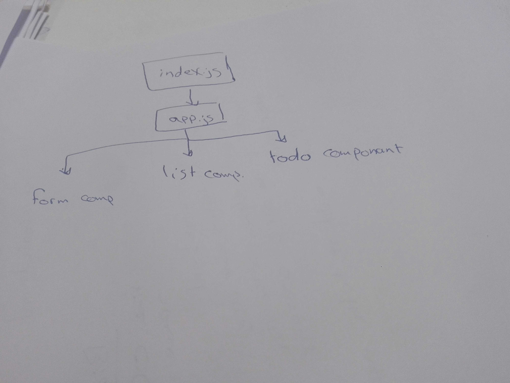

# LAB - Class 31

## Project: todo

### Author: Batool Al-Ali

### Links and Resources

- [submission PR]()
- [netlify]()
- [gh-page]()

### Setup
` $npx i `

#### How to initialize/run your application 
- `$ npm start`

#### UML
