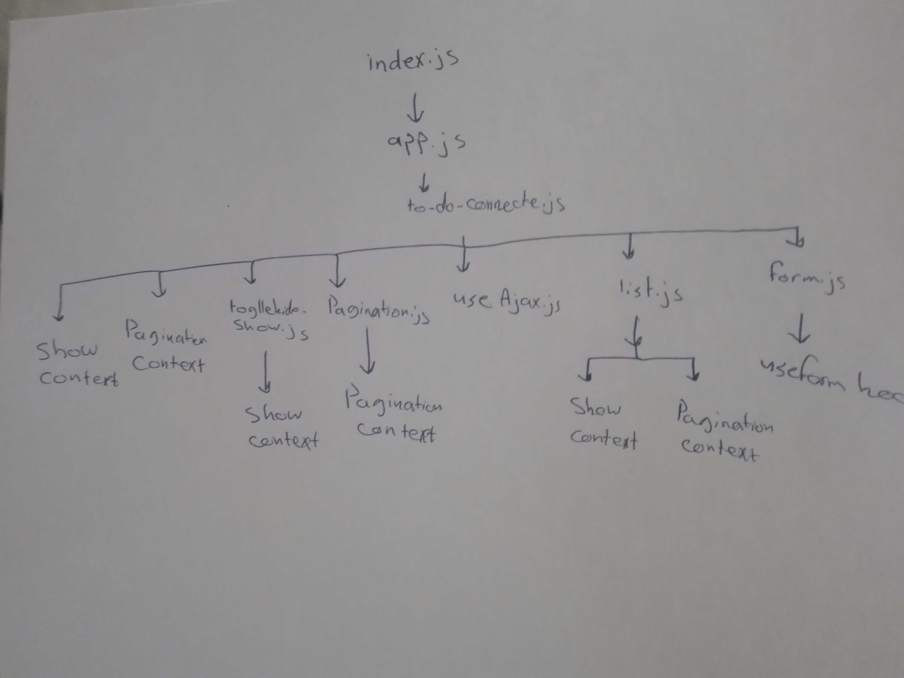

# LAB - Class 34

## Project: todo

### Author: Batool Al-Ali

### Links and Resources

- [submission PR](https://github.com/batool-alali-401-advanced-javascript/todo/pull/12)
- [netlify](https://to-do-v3.netlify.app/)

### Setup
` $npx i `

#### How to initialize/run your application 
- `$ npm start`

#### UML
